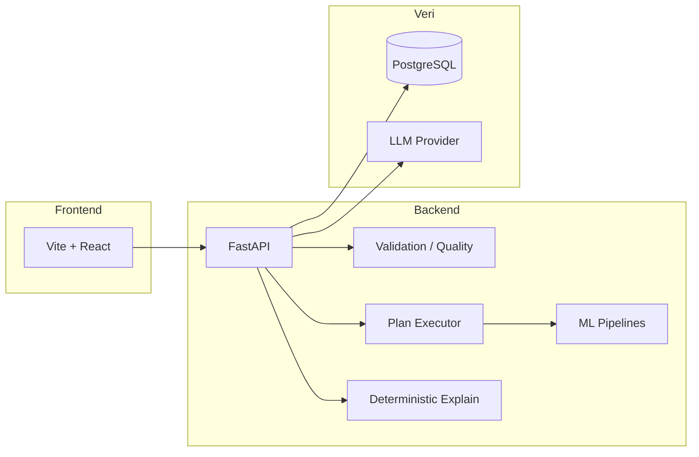
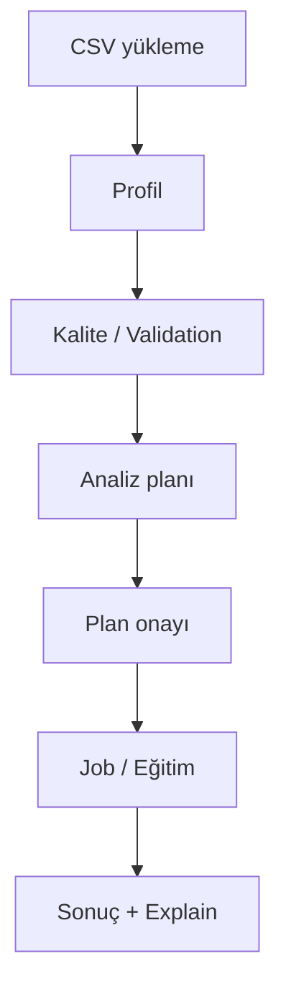

# AutoML Agent

E-ticaret ve kampanya verilerinden **churn tahmini**, **uplift modelleme** ve **müşteri segmentasyonu** üreten tam yığın bir analiz platformu. Ham CSV’yi profilleyip kalite kontrolünden geçirir, LLM ile analiz planı önerir, onay sonrası kayıtlı (registry) pipeline ile model eğitir ve sonuçları iş kullanıcısına anlaşılır şekilde sunar.

**Hedef kitle:** veri bilimciler, ürün analistleri, CRM / growth ekipleri ve teknik mülakat / portföy sunumları için demo arayan geliştiriciler.

**Çözdüğü problemler:** farklı kolon adlarına sahip CSV’ler, düşük veri kalitesi, planın kodda güvenli çalıştırılması, çoklu ML use-case’lerinin tek ürün altında toplanması ve sonuçların aksiyona dönük anlatılması.

---

## Desteklenen modüller

| Modül | Şablon kimliği | Özet |
|--------|----------------|------|
| **Churn tahmini** | `churn` | RFM benzeri özellikler + Random Forest; risk listesi, retention insights, deterministik explain |
| **Uplift modelleme** | `uplift` | T-Learner (kampanya etkisi); hedef listesi, holdout metrikleri, deterministik explain |
| **Müşteri segmentasyonu** | `segmentasyon` | K-Means + persona kartları; segment listesi, CSV export, deterministik explain |

Kayıtlı şablonlar yalnızca bu üçüdür (`templates/registry.py`).

---

## Sistem mimarisi



| Katman | Konum | Rol |
|--------|--------|-----|
| **Backend** | `project/backend/` | REST API, auth, ingest, plan/job, ML eğitimi |
| **Frontend** | `project/frontend/` | 1→9 demo akışı, sonuç ekranları, CSV export |
| **Veritabanı** | PostgreSQL (`DATABASE_URL`) | Kullanıcı, dataset, plan snapshot, job, model metrikleri |
| **LLM** | `LLM_PROVIDER` | Plan üretimi (`mock` / OpenAI / Gemini / Ollama); kayıtlı şablonlar için explain **deterministik** |

Ayrıntılı mimari: [`docs/ARCHITECTURE_TR.md`](docs/ARCHITECTURE_TR.md)

---

## Veri akışı



1. **CSV** — `POST /ingest/csv`
2. **Profil** — `POST /profile/{table_name}`
3. **Kalite** — `GET /datasets/{id}/validation`, `GET /datasets/{id}/quality` (`?template=churn|uplift|segmentasyon`)
4. **Plan** — `POST /datasets/{id}/plans` → `POST /plans/{id}/approve`
5. **Eğitim** — `POST /plans/{id}/jobs` → polling → `GET /jobs/{id}/result`
6. **Sonuç** — Frontend sonuç görünümü + `POST /agent/explain`

Demo adımları: [`docs/DEMO_SCENARIOS_TR.md`](docs/DEMO_SCENARIOS_TR.md)

---

## Özellikler

- Hibrit kolon eşleştirme (exact / alias / fuzzy)
- Pydantic ile doğrulanmış analiz planı; registry dışı cleaning/feature adımları reddedilir
- Çok kullanıcılı auth (JWT) ve dataset sahipliği
- Şablon bazlı validation ve 0–100 kalite skoru
- Churn / uplift / segmentasyon için ayrı sonuç UI’ları ve tarayıcı CSV export
- `LLM_PROVIDER=mock` ile anahtarsız yerel demo
- 138+ backend testi; production build (`npm run build`)

---

## Kurulum

### Gereksinimler

- Python 3.11+
- Node.js 18+
- PostgreSQL (ör. [Neon](https://neon.tech))

### Backend

```powershell
cd project\backend
copy .env.example .env
# DATABASE_URL, SECRET_KEY, LLM_PROVIDER=mock
pip install -r requirements.txt
uvicorn main:app --reload --host 127.0.0.1 --port 8000
```

Swagger: `http://127.0.0.1:8000/docs`

### Frontend

```powershell
cd project\frontend
copy .env.example .env
# VITE_API_URL=http://127.0.0.1:8000
npm install
npm run dev
```

Tarayıcı: `http://localhost:5173` — giriş/kayıt sonrası demo akışı başlar.

Auth migration (mevcut DB): [`docs/MIGRATION_AUTH.md`](../docs/MIGRATION_AUTH.md) (repo kökü)

---

## Geliştirme ortamı

| Değişken | Açıklama |
|----------|----------|
| `DATABASE_URL` | PostgreSQL bağlantı dizesi |
| `SECRET_KEY` | JWT imzalama |
| `LLM_PROVIDER` | `mock` \| `openai` \| `gemini` \| `ollama` |
| `CORS_ORIGINS` | Frontend kökenleri (virgülle ayrılmış) |
| `VITE_API_URL` | Frontend → backend tabanı |

Dağıtım: [`docs/DEPLOYMENT.md`](docs/DEPLOYMENT.md)

---

## Testler

```powershell
cd project\backend
pytest tests/ -q
```

```powershell
cd project\frontend
npm run build
```

---

## Demo Datasetleri

Kaynak: `autoMLdatasets/` (IBM Telco, Hillstrom, Online Retail II). Gerçek, akademik çalışmalarda kullanılan verilerdir; demo için boyutları optimize edilmiştir.

| Modül | Varsayılan demo dosyası | Açıklama |
| ----- | ----------------------- | -------- |
| Churn | `datasets/demo/ecommerce_good.csv` | İşlem düzeyi e-ticaret; churn pipeline ile uyumlu |
| Uplift | `datasets/demo/hillstrom_uplift_demo.csv` | Treatment/outcome; Hillstrom ilk 20 000 satır |
| Segmentasyon | `datasets/demo/online_retail_II_demo.csv` | Online Retail II — 75 000 işlem satırı (RFM) |

Ham referans (UI varsayılanı değil): IBM Telco `WA_Fn-UseC_-Telco-Customer-Churn.csv`, türev `telco_churn_transactions_demo.csv` — churn demo butonu **kullanmaz**.

Yeniden üretim: `python project/backend/scripts/prepare_official_demo_datasets.py`

---

## Demo akışı

Üst şeritte **1→9** adımlı akış: yükleme → profil → validation/quality → plan → onay → job → sonuç → explain.

- **Churn:** `Churn Analizi` → `ecommerce_good.csv` (şablon `churn`)
- **Uplift:** `Uplift Analizi` → `hillstrom_uplift_demo.csv` (şablon `uplift`)
- **Segmentasyon:** `Segmentasyon` → `online_retail_II_demo.csv` (şablon `segmentasyon`)

Kısa rehber: [`docs/DEMO_FLOW.md`](docs/DEMO_FLOW.md) · Senaryolar: [`docs/DEMO_SCENARIOS_TR.md`](docs/DEMO_SCENARIOS_TR.md)

---

## Ekran görüntüleri

| Ekran | Yer tutucu |
|-------|------------|
| Giriş / kayıt | `docs/screenshots/01-auth.png` |
| Veri yükleme ve demo butonları | `docs/screenshots/02-upload.png` |
| Validation ve kalite skoru | `docs/screenshots/03-dataset.png` |
| Plan inceleme ve onay | `docs/screenshots/04-plan.png` |
| Job ilerlemesi | `docs/screenshots/05-job.png` |
| Churn / Uplift / Segmentasyon sonuçları | `docs/screenshots/06-results.png` |

*(Ekran görüntülerini `project/docs/screenshots/` altına ekleyebilirsiniz.)*

---

## Gelecek çalışmalar

- Alembic ile versiyonlu migration’lar
- Uzun job’lar için harici kuyruk (RQ / Celery)
- Segmentasyon için sunucu taraflı sayfalanmış export
- Uplift: ek model aileleri (kayıt defteri genişlemesi)
- E2E tarayıcı testleri (Playwright)

Yol haritası özeti: [`docs/PROJECT_AUDIT_TR.md`](docs/PROJECT_AUDIT_TR.md)

---

## Diğer dokümanlar

| Doküman | İçerik |
|---------|--------|
| [`docs/ARCHITECTURE_TR.md`](docs/ARCHITECTURE_TR.md) | Mimari (Türkçe, diyagramlar) |
| [`docs/DEMO_SCENARIOS_TR.md`](docs/DEMO_SCENARIOS_TR.md) | Sunum senaryoları |
| [`docs/PORTFOLIO_PRESENTATION_TR.md`](docs/PORTFOLIO_PRESENTATION_TR.md) | 10 dk teknik sunum metni |
| [`docs/PROJECT_AUDIT_TR.md`](docs/PROJECT_AUDIT_TR.md) | Kalite ve teknik borç |
| [`docs/API_EXAMPLES.md`](docs/API_EXAMPLES.md) | REST örnekleri |
| [`docs/ARCHITECTURE.md`](docs/ARCHITECTURE.md) | Mimari yönlendirme → `ARCHITECTURE_TR.md` |

---

## Güvenlik notu

LLM SQL çalıştırmaz; eğitim yalnızca onaylı plan ve allowlist executor üzerinden yapılır. API anahtarlarını repoya commit etmeyin. Ayrıntılar: [SECURITY.md](../SECURITY.md).

---

## Lisans

Bu proje [MIT License](../LICENSE) ile lisanslanmıştır.
